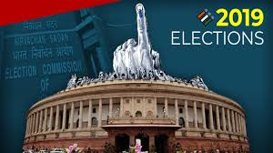
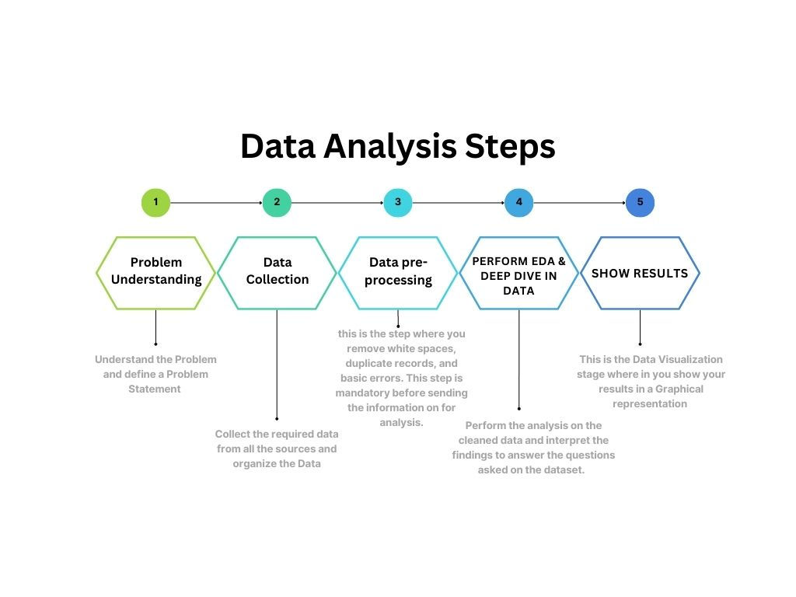

# Indian Elections 2019 Analysis(EDA)
This ipython notebook is the <b>Exploratory data analysis (EDA)</b> of the <b>Indian Lok Sabha Elections 2019</b>. 
The dataset used has been taken from Kaggle which was complied by scrapping the MyNeta.info maintained by the Association for Democratic Reforms and the website of Election Commission of India.  
Dataset: <a href="https://www.kaggle.com/datasets/prakrutchauhan/indian-candidates-for-general-election-2019">Indian Candidates for General Election 2019</a>  

You can follow the analysis on Kaggle at: <a href="https://www.kaggle.com/code/shrikrishnaparab/indian-elections-2019-analysis-eda">Indian Elections 2019 Analysis(EDA)</a>

## Python Packeges Used:
 ![Python][python] ![NumPy][numpy-image] ![Pandas][Pandas-image] ![Matplotlib][Matplotlib-image] ![Plotly][Plotly-image]  ![Jupyter Notebook][ipython-image]
 
[python]: https://img.shields.io/badge/python-3670A0?style=for-the-badge&logo=python&logoColor=ffdd54
[numpy-image]: https://img.shields.io/badge/numpy-%23013243.svg?style=for-the-badge&logo=numpy&logoColor=white
[Pandas-image]: https://img.shields.io/badge/pandas-%23150458.svg?style=for-the-badge&logo=pandas&logoColor=white
[Matplotlib-image]: https://img.shields.io/badge/Matplotlib-%23ffffff.svg?style=for-the-badge&logo=Matplotlib&logoColor=black
[Plotly-image]: https://img.shields.io/badge/Plotly-%233F4F75.svg?style=for-the-badge&logo=plotly&logoColor=white
[ipython-image]: https://img.shields.io/badge/jupyter-%23FA0F00.svg?style=for-the-badge&logo=jupyter&logoColor=white

## What is Exploratory Data Analysis?
Exploratory Data Analysis (EDA) is a technique used to gain insights and understanding from a given dataset. It is an approach for analyzing and summarizing data that allows analysts to identify patterns, trends, and relationships within the data. EDA is typically the first step in the data analysis process and also is an iterative process that involves visualizing and summarizing the data in various ways.

The main goal of EDA is to develop a deeper understanding of the data and identify any potential issue or limitation. This process allows analysts to clean and prepare the data for further analysis, and can also reveal insights that can guide the analysis to move in a proper direction.

One of the key tools used in EDA is visualization. Visualizing data in various ways can reveal patterns and relationships that may not be immediately apparent when looking at raw data.
Common visualizations used in EDA include:
    - Histograms
    - Scatter plots
    - Box Plots
    - Bar Charts
    - Line Charts
    - Pie Chart or Donut Chart
    - Bubble Charts
These visualizations can be used to identify outliers, patterns, and trends in the data, and can also be used to compare different subsets of the data.  

Another important aspect of EDA is summarizing the data using statistical measures such as mean, median, standard deviation nd plotting the Corelation Matrix. These measures can be used to understand the distribution of the data and identify any potential outliers.

EDA can also include data cleaning and preprocessing, which is the process of identifying and correcting errors or inconsistencies in the data. This can include handling missing data, removing outliers, or transforming variables to make the data more suitable for analysis.

Overall, EDA is a crucial step in the data analysis process, as it allows analysts to gain a deeper understanding of the data and identify any potential issues or limitations before proceeding with more advanced analysis. It also can also be a great way to find the insights that can guide the further analysis.

## Indian Lok Sabha Elections:
The Lok Sabha elections in India are held every five years to elect members of the lower house of India's bicameral parliament. These elections are conducted by the Election Commission of India, an independent body responsible for overseeing the conduct of all elections in the country.

All citizens of India who are 18 years of age or older are eligible to vote in the Lok Sabha elections. The election process usually takes place over a period of several weeks, with polling held in different parts of the country on different days. The voter turnout in these elections is typically high, with a large percentage of eligible voters casting their ballots.

The political parties and coalitions that win the most seats in the Lok Sabha are called upon to form the government. The leader of the party or coalition that wins the most seats is appointed as the Prime Minister of India.

Latest elections were held in 2019 next general election is due to be held in 2024.

## Lok Sabha Elections 2019
The 17th Lok Sabha election was held in India in April-May 2019 to constitute the 17th Lok Sabha, or lower house of India's bicameral parliament.  

The polling was conducted in seven phases, from April 11 to May 19, 2019. The results of the election were announced on May 23, 2019.  

The Bharatiya Janata Party, led by Prime Minister Narendra Modi, won the election, with 303 of the 543 seats in the Lok Sabha. The Indian National Congress, the main opposition party, won 52 seats, while other parties and alliances won the remaining 188 seats.

## The Task:
The task was to compile the election data from freely available data on internet, clean the data so that to run a analysis on the same and do analysis to get some of the importan insights from the Loksabha elections held in 2019. Further part of this is to use this data, analysis to predict the winning chance of a given candidate. 

## Data Analysis Process:

## About Data:
This data was scraped from the website of myneta.info to get the personal information of each candidate (as per their own sworn affidavits) and the website of Election Commission of India to get the data about the votes received. Later, merged both this datasets to create this comprehensive dataset. Only the candidates who secured at least 1% of the total votes polled in their constituency have been included. You can find this data set at: <a href="https://www.kaggle.com/datasets/prakrutchauhan/indian-candidates-for-general-election-2019">Link</a>
There are 2263 entries in the CSV file with 19 columns, the columns can be divided as:
### Basic Candidate Details:
    - STATE                                     
    - CONSTITUENCY                              
    - NAME                                      
    - WINNER                                    
    - PARTY                                     
    - SYMBOL                                    
    - GENDER                                    
    - CRIMINAL CASES
    - AGE                                       
    - CATEGORY                                  
    - EDUCATION
    - ASSETS                                    
    - LIABILITIES                               
### Voting Details:
    - GENERAL VOTES 
    - POSTAL VOTES 
    - TOTAL VOTES 
    - TOTAL ELECTORS
    - TOTAL VOTES POLLED
    - TOTAL ELECTORS

## Data Preprocessing:
    - Data Cleaning
      Checking For Null Values 
      Checking For Duplicate Rows
      Cleaning the Column Names
      Clean the ASSETS and LIABILITIES column (Rs 30,99,414\n ~ 30 Lacs+ => 3099414)
      Remove \n from the values of EDUCATION columns

## EDA (Data Analysis Results):
Please Go thorugh the ipython file for more in detail analysis, below are some key Details:
### Statewise distribution of the Constituencies all over India: (Chech the graph in the notebook)
    UP has HIghest Constituencies i.e. 80, MH has 48 so on. 
### Statewise distribution of voting percentage all over India: (Chech the graph in the notebook)
    Lakshadweep has highest voting percentage i.e. 83.75
### Constituency vs Statewise participation for the most contesting Political Parties (Chech the graph in the notebook)
    BJP Contested on 420 Constituencies accross 33 states
    INC Contested on 413 Constituencies accross 35 States 
### Statewise report card for the Political Parties in India: (Chech the graph in the notebook)
### Which party won the most constituencies: (Chech the graph in the notebook)
    BJP won on 300 Seats
    INC won on 52 Seats
### Party Wise vote share: (Chech the graph in the notebook)
    BJP got 38.5% vote share
### What has been the general Win vs Loss relationship for the Parties:
    BJP won 300 and lost on 120 Seats 
    INC won 52 and lost on 361 Seats
    DMK won has contested on 23 seats and won all
### What is the Gender Ratio of the Contestants? Also the Gender Ratio of the Winners?
    1760 Male candidates contested out of which 463 won
    258 Male candidates contested out of which 76 won
### Educational Qualification of our politicians: (Chech the graph in the notebook)
    25 % are Post Graduate 
    24 % are Graduate
### What is the relationship of Age and Politics? (Chech the graph in the notebook)
### What relation does the Politician category have with the election results? (Chech the graph in the notebook)
### politicians and criminal cases: (Chech the graph in the notebook)
### Candidate and Winner Assets: (Chech the graph in the notebook)
    88.3% i.e. 475 MPs have assets in Crores
    11.7% i.e. 63 Mps have assets in lakhs
### Category wise Candidates:
    General: 399
    SC: 85
    ST: 55
 

